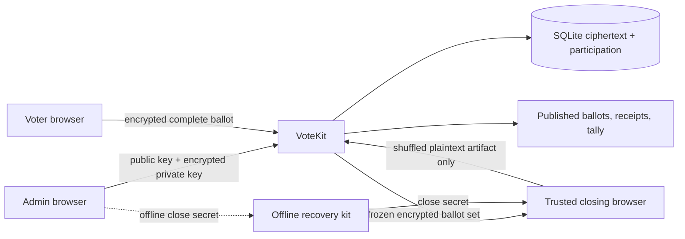

# VoteKit Standalone Encrypted-Until-Shuffled Technical Design

Status: implemented candidate; feature disabled pending review and UAT  
Date: 2026-07-14

## Architecture



No AWS, external key manager, trustee ceremony, specialised hardware, or second
server is required.

## Election key creation

In the administrator browser:

1. Generate an RSA-OAEP-3072 keypair with Web Crypto.
2. Generate a random 256-bit close secret with `crypto.getRandomValues`.
3. Export the private key as PKCS#8 only inside the browser.
4. Encrypt it using AES-256-GCM under the close secret with election/protocol
   metadata as authenticated additional data.
5. Upload the public JWK and encrypted private-key package.
6. Present the close secret as a grouped recovery code and downloadable offline
   recovery kit. Require explicit confirmation before opening.
7. Remove the unencrypted private key and close secret from application state.

The recovery kit must never be uploaded to VoteKit or included in normal server
backups. Multiple offline copies are allowed because Jud is the trusted custodian.

## Ballot envelope

Each voter browser generates:

- one random 256-bit receipt;
- one fresh AES-256-GCM ballot key;
- one random 96-bit IV;
- one canonical fixed-length plaintext containing election UUID, manifest hash,
  protocol, receipt, complete answers, and random padding;
- one AES-GCM ciphertext; and
- one RSA-OAEP-wrapped ballot key.

Authenticated additional data binds the election UUID, question-manifest hash,
schema, and protocol. The outer package contains only public metadata and random
cryptographic material. It has one fixed size for the election.

The Web Crypto API provides RSA-OAEP and AES-GCM in secure browser contexts:
https://developer.mozilla.org/en-US/docs/Web/API/SubtleCrypto/encrypt

## SQLite changes

Additive illustrative tables:

```sql
CREATE TABLE encrypted_election_keys (
  plebiscite_id INTEGER PRIMARY KEY,
  public_key_jwk TEXT NOT NULL,
  encrypted_private_key TEXT NOT NULL,
  key_iv TEXT NOT NULL,
  protocol TEXT NOT NULL,
  manifest_hash TEXT NOT NULL,
  FOREIGN KEY (plebiscite_id) REFERENCES plebiscites(id)
);

CREATE TABLE encrypted_ballots (
  submission_id TEXT PRIMARY KEY,
  plebiscite_id INTEGER NOT NULL,
  voter_roll_id INTEGER NOT NULL,
  ciphertext_package TEXT NOT NULL,
  commitment TEXT NOT NULL,
  state TEXT NOT NULL CHECK(state IN ('accepted','rejected')),
  UNIQUE(plebiscite_id, voter_roll_id),
  UNIQUE(plebiscite_id, commitment),
  FOREIGN KEY (plebiscite_id) REFERENCES plebiscites(id),
  FOREIGN KEY (voter_roll_id) REFERENCES voter_roll(id)
);

CREATE TABLE published_ballots (
  id TEXT PRIMARY KEY,
  plebiscite_id INTEGER NOT NULL,
  receipt_code TEXT NOT NULL,
  ballot_data TEXT NOT NULL,
  UNIQUE(plebiscite_id, receipt_code),
  FOREIGN KEY (plebiscite_id) REFERENCES plebiscites(id)
);
```

The voter linkage in `encrypted_ballots` enforces one vote but is never copied to
published output. Legacy elections continue using the existing `votes` table.

## Atomic acceptance

Vote submission runs in an immediate SQLite transaction. It inserts the encrypted
package, marks participation, and records the ciphertext commitment atomically.
The receipt confirmation screen appears only after commit. Retries use the same
random submission ID and are idempotent.

## Memory-only close

1. Atomically set `open -> closing`; reject all later verification/vote calls.
2. Freeze and hash the complete ordered set of accepted ciphertext commitments.
3. Send all encrypted packages and encrypted key package to the closing browser.
4. Accept the close secret in an input that is never persisted.
5. Decrypt the private key, then every ballot, using Web Crypto.
6. Validate authenticated metadata and every answer against the frozen manifest.
7. Fail the close if any accepted package cannot be accounted for.
8. Shuffle valid ballots using an unbiased Fisher-Yates shuffle driven by
   cryptographic randomness.
9. Rebuild new output objects containing only receipt and semantic answers.
10. Upload the complete artifact with input count/hash and output hash.
11. VoteKit revalidates counts/schema and commits published ballots, cleanup, and
    `closed` state in one immediate transaction.
12. Clear close material from browser state and require page disposal.

The browser must not offer pre-shuffle preview, download, logging, debug output,
or partial decryption. Closing requires a supported modern browser and a single
uninterrupted tab. A CLI using the same audited protocol can later be provided
for larger elections and recovery.

## Results and receipts

One receipt identifies one complete published ballot. Receipt lookup uses a
no-store POST body, not a URL. Public JSON/CSV includes the manifest, shuffled
ballots, method-specific tally details, counts, and artifact hashes. A standalone
verifier can re-run all tallies from the public artifact.

## Failure and recovery

- Lost close secret: unrecoverable by design; use offline duplicate recovery kits.
- Browser closes before upload: no plaintext persisted; reopen and repeat close.
- Upload/commit fails: remain `closing`/`close_failed`; retry against the same
  frozen input manifest.
- Invalid ciphertext: fail closed and investigate rather than silently omit it.
- Large election exceeds browser memory: use the audited local close CLI, never a
  server-side plaintext staging file.
- Existing legacy election: continue legacy close path unchanged.

## Optional enhancements

Hardware-backed keys, confidential-computing enclaves, or external custody may
be offered later as optional deployment modes. They must never be required for a
complete standalone VoteKit installation.
